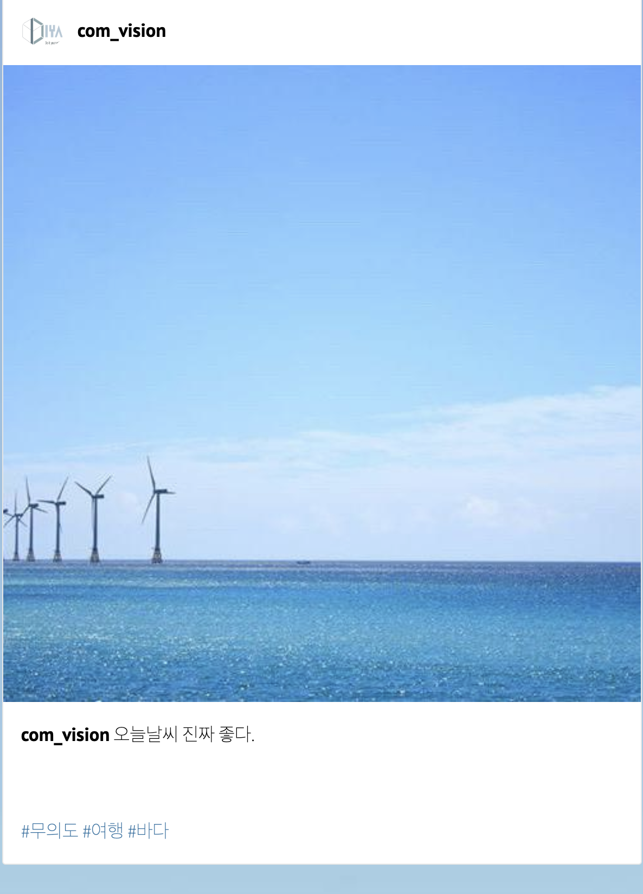
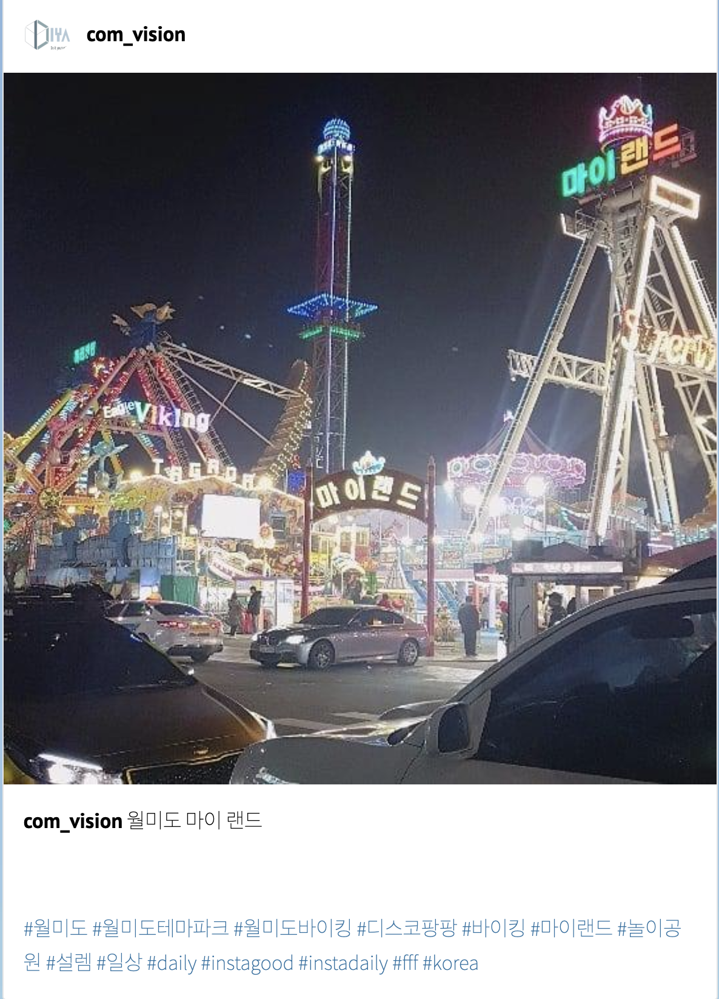

# Instagram Image Captioning & Hashtag Prediction

[English](./README.md)
**Korean**

이미지 캡셔닝을 활용한 인스타그램 스타일 텍스트 및 해시태그 생성.

## Data

[Korean Tourist Spot Multi-Modal Dataset](https://www.mdpi.com/2306-5729/4/4/139)에 약 1천개 정도의 데이터를 추가하여 사용하였습니다.

해당 데이터셋에는 사람의 이미지가 거의 등장하지 않아, 사람이 크게 등장하는 데이터를 대략 1천개 가량 직접 크롤링하여 추가하였습니다.

## 모델 구조

### 베이스라인

베이스라인 모델로는 [Show, Attend and Tell](https://arxiv.org/abs/1502.03044)의 아키텍쳐를 사용하였습니다. 베이스라인 모델의 인코더로는 해당 논문에서 사용한 VGG 대신 ResNet-101을 사용하였습니다.

베이스라인 모델은 본 저장소의 [models/show_att.py](./models/show_att.py)를 참고.

위의 모델을 기반으로, 본 프로젝트에서는 두 가지 방법으로 모델을 개선하고자 했습니다.

### Encoder 개선

베이스라인 모델에서 사용한 ResNet-101 대신, [ResNeXt 32x8d-WSL](https://pytorch.org/hub/facebookresearch_WSL-Images_resnext/) 모델을 인코더로 사용하였습니다.

1. 기본적으로 ResNet보다 ResNeXt가 이미지 분류 문제에서 더 좋은 성능을 보이고
2. [ResNeXt 32x8d-WSL](https://pytorch.org/hub/facebookresearch_WSL-Images_resnext/)의 경우 Weekly Supervised Learning 방법으로 인스타그램 이미지를 활용하여 학습되었기 때문에 인스타그램 이미지 도메인에 더 적합할 것으로 예상하였습니다.

### Decoder 개선

[Look Back and Predict Forward in Image Captioning](http://openaccess.thecvf.com/content_CVPR_2019/papers/Qin_Look_Back_and_Predict_Forward_in_Image_Captioning_CVPR_2019_paper.pdf) 논문에서 나온 Look Back Attention을 적용해봤습니다.

## 결과

### Text Generation

|                     |   BLEU-1   |   ROUGE-L   |   METEOR   |
|---------------------|------------|-------------|------------|
| baseline            |   0.0639   |   0.0897    |   0.0573   |
| ResNeXt             | **0.0738** | **0.0982**  | **0.0664** |
| Look-Back Attention |   0.0649   |   0.0918    |   0.0592   |
| ResNeXt + Look-Back |   0.0736   | **0.0982**  |   0.0657   |

### Hashtag Generation

|                     |   F1       |   Precision   |   Recall   |
|---------------------|------------|---------------|------------|
| baseline            |   0.1454   |   0.214       |   0.1101   |
| ResNeXt             | **0.1709** | **0.2595**    |   0.1274   |
| Look-Back Attention |   0.1475   |   0.2013      |   0.1164   |
| ResNeXt + Look-Back |   0.1617   |   0.2082      | **0.1322** |

### 결과 요약

1. ResNeXt를 사용하면 성능이 향상됨
2. Look Back Attention을 사용하면 성능에 큰 변화가 없거나, 오히려 하락 (특히 ResNeXt 인코더와 함께 사용시)

Look Back Attention이 성능 향상에 도움이 되지 않은 이유로 다음이 있을 것 같습니다.

1. (Text Generation) 한국어는 조사와 어미가 자주 등장하는데, 조사와 어미는 보통 이전에 등장한 단어에 매우 의존적이고, 이전 단어를 생성할때 이미지의 어떤 부분을 봤는지는 상대적으로 중요하지 않음.
2. (Hashtag Generation) 해시태그를 예측할 때, 이전 단계의 context vector나 attention map은 (text generation 대비) 유용하지 않음. 특히, hashtag generation의 성능을 순서가 중요하지 않은 f1, precision, recall 등을 활용하여 측정하였기 때문에 더욱 그런 경향.

### 데모

[데모 페이지](http://cv.diyaml.com)

다음은 위 데모 페이지의 예시입니다. 데모페이지의 경우 인코더로 [ResNeXt 32x8d-WSL](https://pytorch.org/hub/facebookresearch_WSL-Images_resnext/) 모델을 사용하였고, 디코더로는 [Show, Attend and Tell](https://arxiv.org/abs/1502.03044)의 디코더 구조를 사용하였습니다.

