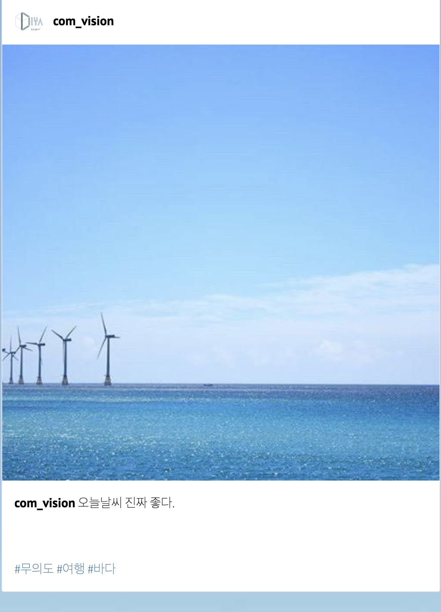

# Instagram Image Captioning & Hashtag Prediction

**English**
[Korean](./README-ko.md)

Image Captioning for generating instagram-style texts and hashtags for images.

## Data

We mainly used [Korean Tourist Spot Multi-Modal Dataset](https://www.mdpi.com/2306-5729/4/4/139), along with one thousand images that we crawled from Instagram.

Because [Korean Tourist Spot Multi-Modal Dataset](https://www.mdpi.com/2306-5729/4/4/139) only has few images of human, we added images where human is the main object. (ex. selfie)

## Model Architecture

### Baseline

For baseline model, we used network architecture from [Show, Attend and Tell](https://arxiv.org/abs/1502.03044). We used ResNet-101 for encoder, instead of VGG in original paper.

Implementation of the baseline model can be found in [models/show_att.py](./models/show_att.py).

We tried to improve the baseline model, both encoder and decoder.

### Improving Encoder

We tried using [ResNeXt 32x8d-WSL](https://pytorch.org/hub/facebookresearch_WSL-Images_resnext/) as our encoder, instead of ResNet-101.

1. ResNeXt performs better than ResNet in image classification task
2. [ResNeXt 32x8d-WSL](https://pytorch.org/hub/facebookresearch_WSL-Images_resnext/) is trained using Instagram images

### Improving Decoder

We tried using Look-Back Attention architecture, from [Look Back and Predict Forward in Image Captioning](http://openaccess.thecvf.com/content_CVPR_2019/papers/Qin_Look_Back_and_Predict_Forward_in_Image_Captioning_CVPR_2019_paper.pdf)

## Result

<!--- 표 추가하기 --->

### Text Generation

|                     |   BLEU-1   |   ROUGE-L   |   METEOR   |
|---------------------|------------|-------------|------------|
| baseline            |   0.0639   |   0.0897    |   0.0573   |
| ResNeXt             | **0.0738** | **0.0982**  | **0.0664** |
| Look-Back Attention |   0.0649   |   0.0918    |   0.0592   |
| ResNeXt + Look-Back |   0.0736   | **0.0982**  |   0.0657   |

### Hashtag Generation

|                     |   F1       |   Precision   |   Recall   |
|---------------------|------------|---------------|------------|
| baseline            |   0.1454   |   0.214       |   0.1101   |
| ResNeXt             | **0.1709** | **0.2595**    |   0.1274   |
| Look-Back Attention |   0.1475   |   0.2013      |   0.1164   |
| ResNeXt + Look-Back |   0.1617   |   0.2082      | **0.1322** |

### Summary of Result

1. Using ResNeXt encoder improved performance for both text and hashtag generation
2. Look Back Attention did not improve model performance, especially when used along with ResNeXt encoder

We suspect that Look Back Attention decoder did not improve performance of our model, because

1. (Text generation) Korean has postposition (조사) and ending (어미), which usually depends only on previous word, not on image. When predicting postposition and ending,  look back attention does not provide much useful information.
2. (Hashtag generation) when generating hashtag, knowing previous context vector or attention map does not provide useful information, especially when model performance was measured using F1-score, which does not take hashtag order into account.

### Demo

[Demo](http://cv.diyaml.com)

Below is an example from our demo page. Network architecture used in demo page is [ResNeXt 32x8d-WSL](https://pytorch.org/hub/facebookresearch_WSL-Images_resnext/) encoder + baseline attention decoder (from [Show, Attend and Tell](https://arxiv.org/abs/1502.03044)).

